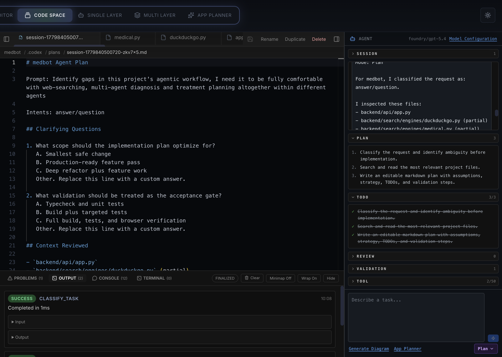
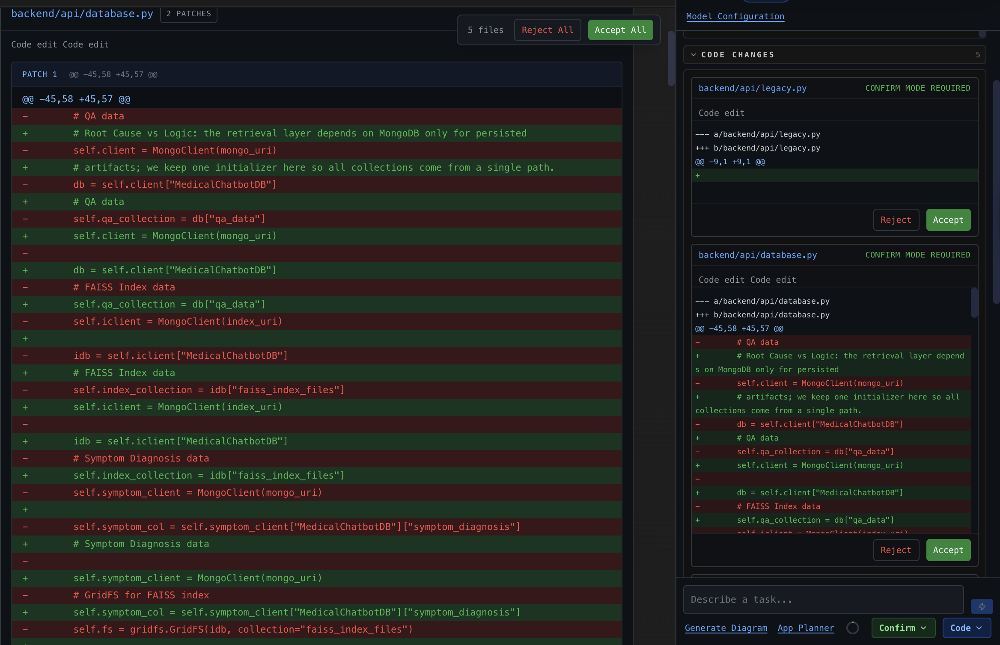

# AgentDiagram

## Now rebranded to [Codoptic](https://github.com/Codoptic/Codoptic)

AgentDiagram is an open-source, locally runnable diagram-as-code editor with an agentic repo explorer and agentic coding workspace.

It is designed to live inside the repository you want to analyze, so the app can scan your codebase locally, generate diagrams from it, and keep the entire workflow on your machine unless you choose to send prompts to an AI provider.

  
**SaaS app architecture diagram illustrated**   

  
**Agentic coding space illustrated**  

  
**Applying code changes in patches**   

## What it does

AgentDiagram combines three closely related workflows in one app:

- A **DSL Diagram Editor** for writing, editing, and exporting diagrams as text.
- An **Agentic Repo Explorer** that turns a local codebase into one or more architecture diagrams.
- A **Coding Agent Space** workspace for interactive agent-driven coding and repo navigation.

The core idea is simple: the DSL stays the source of truth, while layout, rendering, export, and AI-assisted analysis all build on top of it.

## Modes

Use the mode switch in the top bar to move between the main workflows:

- **Diagram Editor** - paste or type DSL, render it live, inspect nodes and edges, and export PNG, SVG, or JSON.
- **Code Space** - an agentic coding workspace for repo-aware tasks.
- **Single Layer** - analyze a repository and generate one architecture layer.
- **Multi Layer** - analyze a repository and generate layered diagrams.
- **App Planner** - describe what you want, answer follow-up questions, and generate a diagram plan.

The main editor is available at `/`, and Code Space is also exposed at `/code-space`.

## Agentic Coding Workflow

Code Space is the part of AgentDiagram that feels most like a coding assistant. It is built around a simple sequence:

1. Pick or create a project.
2. Open or start a session.
3. Choose an agent mode.
4. Ask the agent to inspect the repo, reason about the task, and prepare a plan.
5. Review any proposed file changes before they are applied.
6. Run validation and check the outcome in the bottom panel.

### Session And Run Model

Code Space separates a long-lived **session** from a specific **run**:

- A session is the conversational container. It stores the title, message history, plan, TODOs, tool calls, review state, and verification results.
- A run is one execution of the agent against that session. Runs can be started, cancelled, retried, and tracked independently.

This split makes it easier to keep a persistent discussion while still preserving a clean record of each agent attempt.

### Agent Modes

The code workspace currently ships with three modes:

- **Ask** - read-only analysis and explanation. The agent inspects the repo and answers without changing files.
- **Plan** - deeper analysis that produces an editable markdown plan before any implementation work begins.
- **Code** - the default implementation mode. The agent analyzes the repo, drafts a plan, and moves toward changes with review and validation steps.

The mode selector in the agent panel mirrors this directly, so the user can choose how far the workspace should go before it starts proposing edits.

### What Happens During A Run

The runtime is intentionally structured rather than monolithic. In broad terms, a run does the following:

- Collects project context from the selected repository and the open tabs.
- Detects useful validation commands from the project stack.
- Streams assistant output back into the UI as the run progresses.
- Builds a visible plan and TODO list so the work can be tracked step by step.
- Emits tool calls and patch proposals into the agent panel.
- Marks the run complete once the validation phase finishes.

The current runtime is conservative by design. It creates a visible plan, surfaces the relevant files and commands, and keeps patch application approval-gated so the user stays in control of repository changes.

### Review And Validation

The right-hand agent panel is where the review loop lives:

- Proposed file changes appear as diffs that can be accepted or rejected.
- Tool calls are listed with their status so you can see what the agent is doing.
- The plan and TODO sections show progress in plain language.
- Verification results appear after the agent finishes, including the commands it used to check the repo.

The bottom panel complements that by collecting output, problems, debug events, and terminal activity in one place.

### Why It Feels Different

Instead of hiding all reasoning inside a single chat response, AgentDiagram makes the workflow explicit:

- repo inspection is visible
- plans are visible
- tool usage is visible
- patch review is visible
- validation is visible

That visibility is the whole point of the agentic experience: you can trust the agent more because you can see what it is doing and intervene at the right time.

## Quick Start

1. Clone this repo inside, or alongside, the project you want to analyze.
2. Copy the example environment file and fill in the provider keys you plan to use.
3. Install dependencies and start the dev server.

```bash
git clone <repo-url> path/to/your-project/AgentDiagram
cd path/to/your-project/AgentDiagram
cp .env.local.example .env.local
npm install
npm run dev
```

Open <http://localhost:3000>.

By default, the agentic explorer treats the parent directory of `AgentDiagram/` as the repo to inspect. If you want to point it somewhere else, set `AGENTDIAGRAM_DEFAULT_REPO_PATH` or enter a different absolute path in the UI.

## Local Setup

Recommended project layout:

```text
your-project/
├── src/
├── package.json
└── AgentDiagram/        ← clone this repo here
    ├── app/
    ├── lib/
    └── ...
```

This layout keeps the analyzer close to the project it is inspecting and makes the default repo path predictable.

## DSL At A Glance

The diagram editor uses a compact, line-oriented DSL.

```text
Frontend [color: sky, icon: monitor] {
  UI [icon: layout]
  Router [icon: git-branch]
}

API [color: indigo, icon: server] {
  Auth [icon: shield]
}

UI > Router
Router > Auth
Router <> Auth: bidirectional
Auth -- Router
```

Some practical rules:

- Names can contain spaces, pipes (`Tables from DOCX | PDF`), ampersands (`Quality & Sanitize`), and other readable labels.
- Edge operators such as `>`, `<`, `<>`, `--`, and `=>` must have whitespace on both sides.
- Groups, nodes, and edges can all accept properties like `color`, `icon`, `label`, `direction`, `style`, and `note`.

For the full grammar and examples, see [docs/dsl-grammar.md](docs/dsl-grammar.md).

## AI Providers

AgentDiagram supports multiple providers and lets you switch between them in the UI.

| Provider | Env var | Default model |
| --- | --- | --- |
| OpenAI | `OPENAI_API_KEY` | `gpt-5.5` |
| Anthropic | `CLAUDE_API_KEY` | `opus-4.7` |
| Gemini | `GEMINI_API_KEY` | `gemini-3.1-pro` |
| Grok (xAI) | `GROK_API_KEY` | `grok-3` |
| Mistral | `MISTRAL_API_KEY` | `mistral-large` |
| DeepSeek NLU | `DEEPSEEK_API_KEY` | `deepseek-v4-pro` |
| NVIDIA NIM | `NVIDIA_API_KEY` | `meta/llama-3.1-70b-instruct` |
| Azure AI Foundry | `FOUNDRY_API_KEY` | custom deployment name |

Optional model overrides are also supported through `.env.local`:

- `OPENAI_MODEL`
- `CLAUDE_MODEL`
- `GEMINI_MODEL`
- `GROK_MODEL`
- `MISTRAL_MODEL`
- `DEEPSEEK_MODEL`
- `NVIDIA_MODEL`
- `FOUNDRY_MODEL`

Additional provider settings:

- `MISTRAL_ENDPOINT` - override the Mistral base URL (default `https://api.mistral.ai/v1`).
- `DEEPSEEK_ENDPOINT` - override the DeepSeek base URL (default `https://api.deepseek.com`).
- `NVIDIA_ENDPOINT` - override the NVIDIA NIM endpoint (default `https://nvidia.com`).
- `GROK_API_BASE` - override the Grok base URL when needed.
- `FOUNDRY_ENDPOINT` - required Azure AI Foundry endpoint.
- `AGENTDIAGRAM_DEFAULT_PROVIDER` - choose the default provider shown in the UI (`openai`, `anthropic`, `gemini`, `grok`, `mistral`, `deepseek`, `nvidia`, `foundry`).

Provider details, retry behavior, and validation flow are documented in [docs/providers.md](docs/providers.md).

## Environment Variables

The most commonly used settings are listed below. See [docs/local-setup.md](docs/local-setup.md) and [docs/providers.md](docs/providers.md) for the complete list.

| Variable | Purpose |
| --- | --- |
| `OPENAI_API_KEY` | OpenAI provider key |
| `OPENAI_MODEL` | Optional OpenAI model override |
| `CLAUDE_API_KEY` | Anthropic provider key |
| `CLAUDE_MODEL` | Optional Anthropic model override |
| `GEMINI_API_KEY` | Google Gemini provider key |
| `GEMINI_MODEL` | Optional Gemini model override |
| `GROK_API_KEY` | xAI Grok provider key |
| `GROK_MODEL` | Optional Grok model override |
| `GROK_API_BASE` | Optional Grok API base URL |
| `MISTRAL_API_KEY` | Mistral provider key |
| `MISTRAL_MODEL` | Optional Mistral model override |
| `MISTRAL_ENDPOINT` | Optional Mistral endpoint URL |
| `DEEPSEEK_API_KEY` | DeepSeek provider key |
| `DEEPSEEK_MODEL` | DeepSeek model override |
| `DEEPSEEK_ENDPOINT` | DeepSeek endpoint URL |
| `NVIDIA_API_KEY` | NVIDIA NIM provider key |
| `NVIDIA_MODEL` | NVIDIA model override |
| `NVIDIA_ENDPOINT` | NVIDIA NIM endpoint URL |
| `FOUNDRY_API_KEY` | Azure AI Foundry provider key |
| `FOUNDRY_ENDPOINT` | Azure AI Foundry endpoint URL |
| `FOUNDRY_MODEL` | Azure deployment name |
| `AGENTDIAGRAM_DEFAULT_PROVIDER` | Default provider selection |
| `AGENTDIAGRAM_DEFAULT_REPO_PATH` | Override the default repo path |

You only need one provider key to get started.

## Scripts

```bash
npm run dev          # Next.js dev server
npm run build        # Production build
npm run start        # Serve the production build
npm run lint         # ESLint
npm run typecheck    # TypeScript without emit
npm test             # Vitest
npm run test:watch   # Vitest in watch mode
npm run test:e2e     # Playwright end-to-end tests
npm run test:visual  # Visual regression tests
npm run format       # Prettier formatting
npm run render:example # Render the example diagram
```

## Repository Layout

The main code is organized into a few broad areas:

- `app/` - Next.js routes, API endpoints, and top-level pages.
- `components/` - UI for the shell, editor, diagram, agent panels, inspector, and Code Space.
- `lib/dsl/` - lexer, parser, compiler, formatter, and tests for the DSL.
- `lib/layout/` - layout engines and geometry helpers.
- `lib/render/` - SVG scene generation, routing, and visual theming.
- `lib/export/` - PNG, SVG, PDF, and download helpers.
- `lib/agent/` - repo scanning, chunking, summarization, planning, provider routing, and repair loops.
- `lib/code-space/` - agentic workspace domain logic and runtime orchestration.
- `docs/` - grammar, architecture, provider, and setup documentation.
- `examples/` - sample DSL inputs and screenshots.

## Rendering And Export

The editor renders diagrams to SVG first, then reuses the same scene for export.

That means:

- what you see in the browser is what gets exported
- PNG and SVG exports stay in sync with the viewport
- layout changes are driven by the same underlying graph and theme system

Exports are available from the editor UI, and the current diagram can also be printed.

## Privacy And Local Behavior

AgentDiagram is intentionally local-first.

- Repo scanning happens server-side on your machine.
- The scanner honors `.gitignore` and avoids obvious sensitive paths and file types.
- AI requests send selected chunks and per-file summaries, not the whole repository.
- Cached summaries live in `.agentdiagram-cache/`, which is ignored by Git.
- API keys entered in the UI are kept in server-process memory for the current session and are not written to disk.

## Architecture

For a deeper look at the internals, see [docs/architecture.md](docs/architecture.md).

At a high level:

```text
Monaco DSL editor
  -> lexer
  -> parser
  -> compiler
  -> IR
  -> layout
  -> SVG scene
  -> viewport + export
```

The app also includes a staged AI pipeline for scanning, classifying, chunking, summarizing, planning, compiling, and repairing repo-derived diagrams.

## Documentation

- [docs/local-setup.md](docs/local-setup.md) - installation, `.env.local`, and security notes
- [docs/dsl-grammar.md](docs/dsl-grammar.md) - DSL syntax and examples
- [docs/providers.md](docs/providers.md) - provider setup and retry behavior
- [docs/architecture.md](docs/architecture.md) - system architecture and design choices

## Known Limitations

- Sequence and class diagrams currently reuse the same flow-layout pipeline as other diagrams.
- There is no multi-user persistence layer; projects save locally through IndexedDB or exported `.diagram.json` files.
- Provider model defaults match the values configured in the repo, but availability still depends on your account and deployment setup.

## License

MIT - see [LICENSE](LICENSE).
